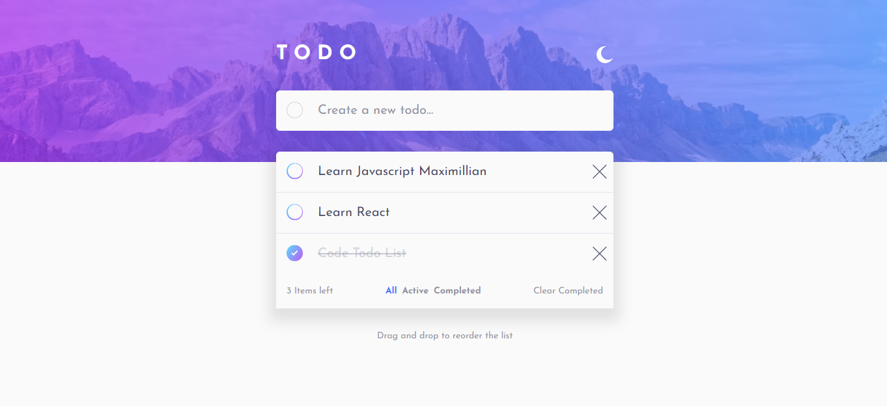

# Frontend Mentor - Todo app solution

This is a solution to the [Todo app challenge on Frontend Mentor](https://www.frontendmentor.io/challenges/todo-app-Su1_KokOW). Frontend Mentor challenges help you improve your coding skills by building realistic projects.

## Table of contents

-   [Overview](#overview)
    -   [The challenge](#the-challenge)
    -   [Screenshot](#screenshot)
    -   [Links](#links)
-   [My process](#my-process)
    -   [Built with](#built-with)
    -   [What I learned](#what-i-learned)
    -   [Continued development](#continued-development)
    -   [Useful resources](#useful-resources)
-   [Author](#author)
-   [Acknowledgments](#acknowledgments)

**Note: Delete this note and update the table of contents based on what sections you keep.**

## Overview

### The challenge

Users should be able to:

-   View the optimal layout for the app depending on their device's screen size
-   See hover states for all interactive elements on the page
-   Add new todos to the list
-   Mark todos as complete
-   Delete todos from the list
-   Filter by all/active/complete todos
-   Clear all completed todos
-   Toggle light and dark mode
-   **Bonus**: Drag and drop to reorder items on the list

### Screenshot

### Links

-   Solution URL: [Add solution URL here](https://your-solution-url.com)
-   Live Site URL: [Add live site URL here](https://your-live-site-url.com)

### Built with

-   HTML
-   CSS custom properties
-   [React](https://reactjs.org/) - JS library
-   [Styled Components](https://styled-components.com/) - For styles
-   [Redux](https://react-redux.js.org/) - Global State Management

### Packages

I started by installing the Necessary packages:

1. React
2. Redux Toolkit.
3. Redux Persist.
4. React Redux.
5. React Beautiful dnd.
6. Styled Components.

## My process

1. Then, I started Drawing on excalidraw to split the design into components
   it was tough trying to get the right set of components to start coding
   I managed to make it.

2. I started the Design by implementing **Theme**, then
   I started Designing **Header** I had tough time due to me
   being very comfortable with Vanilla JS and SASS in the end I did it.

3. I jumped to the **TodoForm** to start laying out the Form input styles
   Styling it was one of the toughest things I did due to CSS being tricky
   to handle.

4. I made the Tasks Styles and **Checkbox** manually from scratch and did the transition
   the tricky part was to make the outline gradient.

5. I did the Footer and the Filtering at one time it was simple to make.

6. I Implemented the **Theme** with React State to be Dynamic.

7. I implemented the Task Add Functionalty and Delete Task and Mark as Complete Task without Redux.

8. Then I made Redux store to handle tasks CRUD Operations and Refactored the code to do so.

9. **I did the most thing that I am proud of React Drag and Drop Functionality it was
   very satisfying to make due to me being new to this thing in React**.

10. I then Used **Redux Persist** to make tasks Saved in Local Storage on Refresh.

### What I learned

I Broke the Fear of dealing with React Packages especially Redux
and I learnt by myself a lot of useful tools and techniques along the way.

### Continued development

When I learn Backend I want to implement the API by myself
I also want to implement the shadow effect When Holding
The item I think it's cool.

### Useful resources

-   [React Beautiful dnd](https://github.com/atlassian/react-beautiful-dnd) - React dnd.
-   [Custom Checkbox](https://moderncss.dev/pure-css-custom-checkbox-style/) - Making Custom Checkbox from scratch.

## Author

-   Website - [Saleh](https://honko-o.github.io/FEM-TodoList/)
-   Frontend Mentor - [@Honko-o](https://www.frontendmentor.io/profile/Honko-o)

## Acknowledgments

I thankful to **Alex Marshall** in FEM community he helped me clear doubts when I was doing this challenge.
